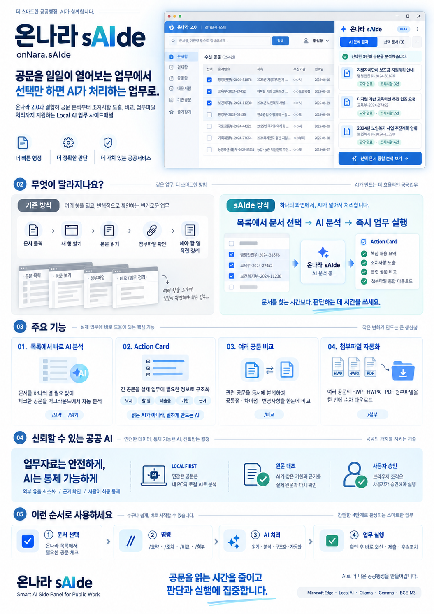
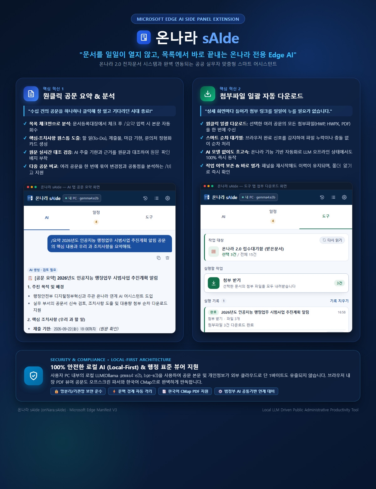
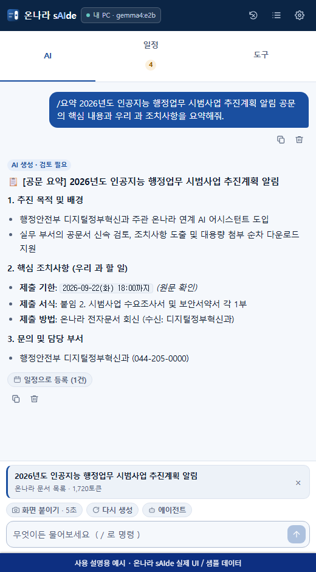
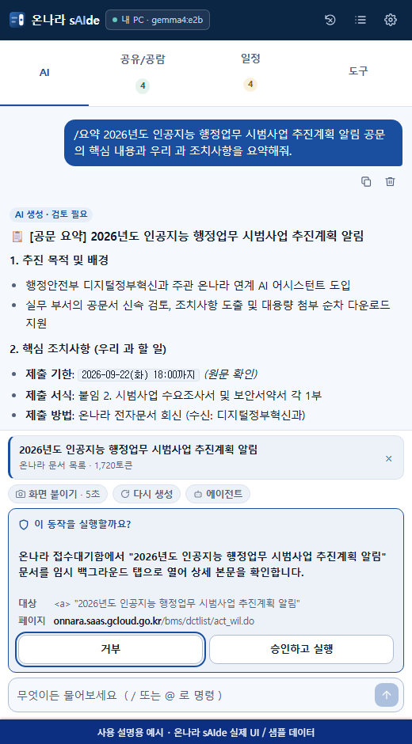
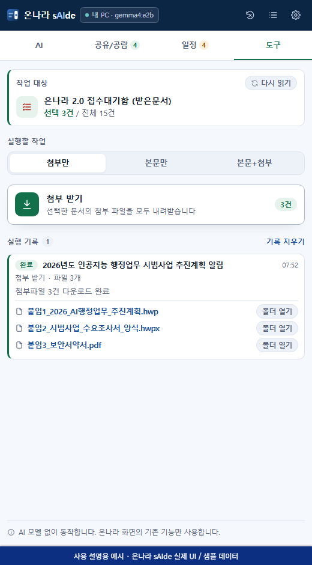
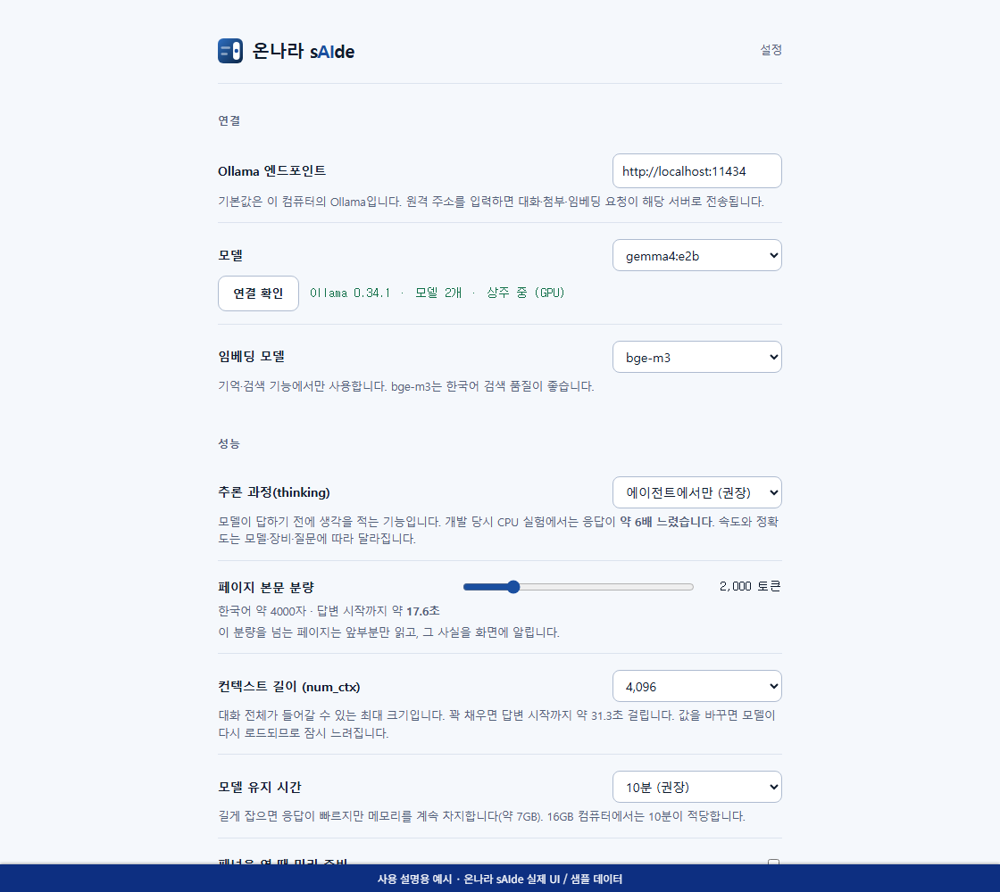
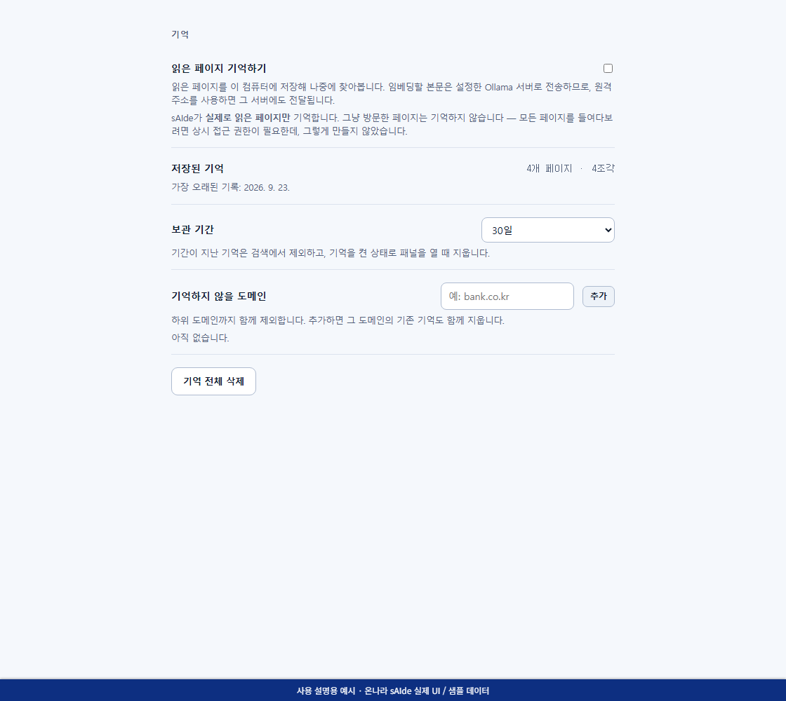
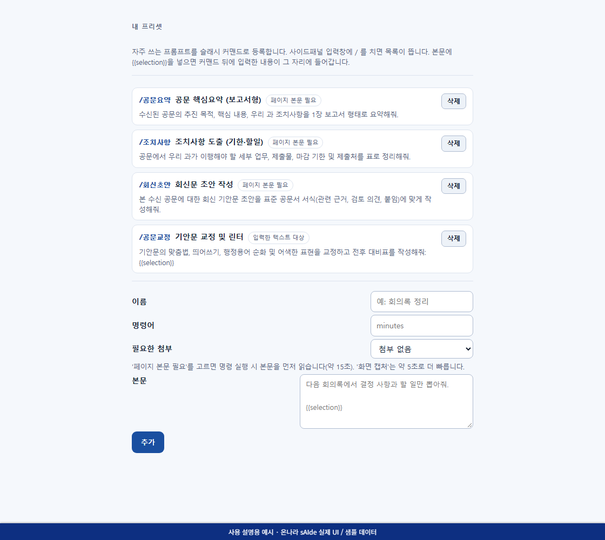

# 온나라 sAIde (onNara.sAIde)

> **공문 열람의 패러다임을 바꿉니다 — 문서를 일일이 열어보지 않고 목록에서 바로 파악하고 처리하는 온나라 전용 Edge AI 사이드패널**  
> 끝없는 새 창 띄우기와 첨부 다운로드의 반복에서 벗어나, 가장 스마트하고 안전한 업무 어시스턴트를 경험하세요.






---

## 시스템 소개: 행정업무 생산성을 극대화하는 온나라 전용 AI 파트너

**온나라 sAIde**는 공무원 및 공공기관 실무자가 온나라 2.0 전자문서 시스템을 사용할 때 겪는 반복적인 비효율을 해소하기 위해 탄생한 Microsoft Edge 전용 AI 사이드패널 확장 프로그램(Manifest V3)입니다.

단순한 대화형 챗봇이 아닙니다. 온나라 전자문서 화면과 유기적으로 결합하여 실무자의 가장 많은 시간을 앗아가는 **'공문 열람·분석'**과 **'첨부파일 취합'** 업무를 획기적으로 혁신합니다.

### 🌟 핵심 혁신 가치 1: 문서등록대장에서 문서를 일일이 열어보지 않고도 AI 요약·분석 완료!
> **"수십 건의 공문을 하나하나 클릭해서 창 열고 뷰어 로딩을 기다리던 시대는 끝났습니다."**

* **목록 체크만으로 백그라운드 자동 분석**: 문서등록대장이나 접수대기함에서 관심 있는 공문들을 체크박스로 선택하기만 하면, sAIde가 원본 화면을 그대로 유지한 채 백그라운드에서 각 문서의 본문을 스스로 회수해 분석합니다.
* **핵심·조치사항 원스톱 도출 (Action Card)**: 단순한 줄글 요약에 그치지 않고, 우리 과가 처리해야 할 **세부 할 일(To-Do)**, **제출 서식 및 제출물**, **제출 마감 기한**, **소관 부서 및 문의처**를 정형화된 카드로 일목요연하게 도출합니다.
* **원문 실시간 대조 검증 (No Hallucination)**: AI가 추출한 기한 날짜와 근거 문장을 시스템 코드가 원문 텍스트와 즉시 대조하여 `원문 확인` 배지를 부여하므로, 안심하고 업무에 바로 활용할 수 있습니다.
* **다중 공문 비교·분석 (`/비교`)**: 여러 관련 공문을 한 번에 선택해 지침 변경 사항, 공통점, 상충 내용까지 한 화면에서 즉시 비교·대조합니다.

### 🚀 핵심 혁신 가치 2: 문서등록대장에 등록된 문서의 첨부파일 일괄 자동 다운로드!
> **"첨부파일 하나 받으려고 매번 상세 화면에 들어가 다운로드 링크를 일일이 누르고 계셨나요?"**

* **원클릭 일괄 다운로드**: 문서등록대장에서 여러 문서를 선택한 뒤 `첨부 받기` 버튼(또는 `/첨부` 명령) 한 번만 누르면, 각 공문에 첨부된 모든 파일(HWP, HWPX, PDF 등)을 백그라운드에서 한 번에 묶어 내려받습니다.
* **안정적인 브라우저 순차 처리**: 브라우저의 다운로드 세션을 정밀하게 감시하여, 한 파일의 전송 완료를 확인한 후 다음 파일로 안전하게 넘어가는 스마트 대기열을 탑재했습니다. 누락이나 다운로드 충돌이 전혀 없습니다.
* **AI 모델 없이도 초고속 구동**: 순수 브라우저 자동화 기술로 동작하므로 로컬 AI 모델이 꺼져 있거나 오프라인 상태에서도 100% 즉시 동작합니다.
* **작업 이력 보존 및 원클릭 열기**: 패널을 닫았다가 다시 열어도 이전 다운로드 이력이 유지되며, `파일 열기` 및 `폴더 열기` 버튼을 지원하여 파일 탐색기를 찾아 헤맬 필요가 없습니다.

### 📅 핵심 혁신 가치 3: 공문에서 도출된 내 할 일과 기한을 그대로 일정으로!
> **"공문을 읽고 나서 수첩에 기한을 옮겨 적고, 그 수첩을 다시 확인하는 일을 없앱니다."**

* **분석 결과에서 곧바로 등록**: `/조치` 분석 답변 아래의 **`일정으로 등록`** 버튼을 누르면 우리 과가 해야 할 일과 제출 기한이 후보로 뜨고, **체크한 항목만** 일정 탭으로 들어갑니다. AI가 뽑았다고 해서 자동으로 등록되는 경로는 없습니다.
* **공문식 날짜 자동 해석**: `2026. 9. 30.(수)`, `9월 30일 18:00까지` 같은 공문 표기를 달력 날짜로 바꿔 D-day로 관리합니다. 연도가 생략된 기한은 그 공문의 **보고일자를 기준으로** 해석하고 `연도 추정` 배지를 남겨 사용자가 확인할 수 있게 합니다.
* **월간 달력과 D-day 목록을 함께**: 월·주·일 달력으로 이번 달에 무엇이 몰려 있는지 한눈에 보고, 목록 보기로는 지금 급한 것부터 처리합니다.
* **지난 기한을 숨기지 않음**: 달력에서는 붉은 칩과 점으로, 목록에서는 기한 지남 · 오늘 · 이번 주 · 나중 · 기한 미정 구간의 맨 위에 `D+n`으로 남습니다.
* **패널을 닫아도 울리는 알림**: 브라우저가 실행 중이면 사이드패널을 닫아 두어도 하루 한 번(기본 오전 9시) 지난 기한·오늘·내일 기한을 묶어 알립니다.
* **근거를 잃지 않는 내보내기**: 근거 문장까지 담은 **CSV**(기록용)와 남은 기한만 담은 **ICS**(달력용)로 내보낼 수 있습니다.

---

## 핵심 보안 및 신뢰성 원칙

* 🔒 **100% 로컬 추론 우선 (Local-First)**: 사용자 PC에 설치된 경량 LLM(Ollama `gemma4:e2b`, `bge-m3`)을 기본 엔진으로 사용하여 민감한 공문 본문과 개인정보가 외부 클라우드로 단 1바이트도 유출되지 않습니다.
* 🛡️ **사람 중심 안전 승인 (Fail-Closed & Approval)**: 브라우저 조작이나 화면 이동이 필요할 때는 반드시 사용자에게 사전 승인 카드(`ApprovalCard`)를 제시하며, 사람의 명시적 승인 없이 무단으로 온나라 시스템을 조작하지 않습니다.
* 📄 **행정 표준 뷰어 완벽 지원**: HTML 텍스트뿐만 아니라 브라우저 내장 PDF 뷰어로 열리는 공문도 오프스크린 파서(한국어 CMap 동봉)를 통해 텍스트 레이어를 완벽히 추출합니다.
* ⚡ **문맥 경계 자동 분리 (Context Isolation)**: 새 문서를 열거나 명령을 실행하면 모델 전송 문맥(`contextFrom`)이 자동 격리되어 이전 공문 내용이 섞이거나 토큰이 낭비되지 않습니다.

---

## 설치 및 빠른 시작 가이드

온나라 sAIde를 개발 환경 또는 업무 PC에서 구동하는 단계별 안내입니다.

### 1. 사전 요구사항

1. **Microsoft Edge** 브라우저 (Chromium 기반)
2. **Node.js** 24.x 이상 및 **npm** 11.x 이상
3. **Ollama** (0.34.1 이상 권장)
   * 공식 웹사이트([ollama.ai](https://ollama.ai))에서 다운로드 및 설치

### 2. Ollama 모델 다운로드 및 실행

터미널(PowerShell 또는 명령 프롬프트)에서 기본 대화 모델과 임베딩 모델을 내려받습니다.

```powershell
# 1. 기본 대화 모델 설치 (Gemma 4 e2b 권장)
ollama pull gemma4:e2b

# 2. 기본 임베딩 모델 설치 (BGE-M3 권장)
ollama pull bge-m3:latest

# 3. 모델 정상 설치 확인
ollama list
```

> **CORS(Cross-Origin) 허용 설정 안내:**  
> 브라우저 확장에서 로컬 Ollama에 접근하려면 Ollama 환경 변수에 확장의 Origin을 허용해야 합니다.  
> Windows 환경 변수에서 `OLLAMA_ORIGINS`를 `chrome-extension://*`로 설정한 후 Ollama 서비스를 재시작해 주세요.

### 3. 저장소 복제 및 의존성 설치

```powershell
# 1. 의존성 설치
npm ci

# 2. 로컬 환경 변수 파일 생성
Copy-Item .env.example .env.local

# 3. 정적 타입 검사 및 테스트 실행
npm run compile
npm test
```

### 4. 프로덕션 빌드 및 Edge 브라우저에 확장 로드

```powershell
# 1. Edge MV3용 번들 빌드
npm run build

# 2. 빌드 무결성 및 색상 대비 검증
npm run verify
```

빌드가 완료되면 프로젝트 루트의 `.output/edge-mv3` 디렉터리에 배포 가능한 확장 패키지가 생성됩니다.

#### Microsoft Edge 브라우저에 등록하는 절차:
1. Microsoft Edge 브라우저를 열고 주소창에 `edge://extensions`를 입력합니다.
2. 좌측 하단(또는 상단)의 **개발자 모드(Developer mode)** 토글 스위치를 켭니다.
3. 상단에 나타난 **압축 해제된 확장 로드(Load unpacked)** 버튼을 클릭합니다.
4. 파일 선택 대화상자에서 프로젝트 디렉터리 내의 `.output/edge-mv3` 폴더를 선택합니다.
5. 설치가 완료되면 Edge 브라우저 우측 상단 도구 모음에 **온나라 sAIde** 아이콘이 표시됩니다.
6. 아이콘을 툴바에 고정(고정 핀 아이콘 클릭)한 뒤 클릭하여 **오른쪽 사이드패널**을 엽니다.

---

## 사용자 매뉴얼 (화면별 상세 안내)

### AI 사이드패널 및 대화 인터페이스


*(사용 설명용 예시 · 온나라 sAIde 실제 UI / 샘플 데이터)*

사이드패널의 **AI** 탭은 현재 온나라 화면의 문서를 읽고 지능적인 요약, 질의응답, 비교 분석을 수행하는 메인 작업 공간입니다.

* **상단 헤더(Header)**:
  * 현재 연결된 공급자 및 모델명(`ollama:gemma4:e2b`)이 표시됩니다.
  * 초록색 배지로 `로컬` 처리 상태임을 한눈에 확인할 수 있습니다.
  * 우측 상단의 **현재 대화 초기화(Trash)** 아이콘을 누르면 진행 중인 작업을 안전하게 취소하고 현재 세션의 대화와 첨부 문맥을 깨끗이 비웁니다(다른 세션은 보존).
* **문서 본문 첨부 칩 (`PageContextChip`)**:
  * 온나라 목록이나 문서 본문에서 읽어 들인 문서의 제목, 글자 수, 파싱 방식이 칩 형태로 표시됩니다.
  * 칩 우측의 `×` 버튼을 누르면 해당 문서 본문과 관련 문답이 문맥에서 즉시 제외되어 새 작업을 시작할 수 있습니다.
* **대화 목록 (`MessageList`)**:
  * AI가 작성한 모든 답변에는 **`AI 생성 · 검토 필요`** 배지가 붙어 사용자의 최종 검토를 유도합니다.
  * 각 메시지 하단의 **복사** 아이콘으로 내용을 클립보드에 복사하거나, **삭제** 아이콘으로 특정 메시지만 대화 기록에서 제거할 수 있습니다.

---

### 온나라 목록 연동 슬래시(`/`) 명령 체계

온나라 받은문서나 문서등록대장 목록에서 원하는 문서들을 체크박스로 선택한 후, 입력창에 슬래시(`/`) 명령을 입력하면 AI가 정형화된 작업을 즉시 수행합니다.

| 명령어 | 영문 별칭 | 주요 동작 및 활용법 | AI 모델 사용 |
|:---|:---|:---|:---:|
| **/요약** | `/summary` | 체크한 문서를 순차적으로 열어 핵심 내용을 요약합니다. 뒤에 추가 지시를 붙일 수 있습니다.<br>*(예: `/요약 예산 및 추진 일정 위주로`)* | ✅ |
| **/조치** | `/actions` | 핵심·조치사항 카드(요약, 할 일, 제출물, 기한, 문의처)를 생성하고 원문과 대조합니다. | ✅ |
| **/비교** | `/compare` | 체크한 여러 공문을 한 번에 읽어 공통점, 차이점, 연관성을 비교 분석합니다.<br>*(예: `/비교 변경된 지침 내용을 대조해줘`)* | ✅ |
| **/읽기** | `/read` | 요약 과정 없이 공문 본문 텍스트만 읽어 대화 문맥에 즉시 첨부합니다. 이후 자유롭게 후속 질문이 가능합니다. | ❌ |
| **/첨부** | `/attach` | 체크한 문서의 첨부파일을 브라우저를 통해 백그라운드에서 모두 순차 다운로드합니다. | ❌ |
| **/새로고침** | `/refresh` | 온나라 목록의 최신 상태 및 체크박스 선택 현황을 다시 읽어와 패널에 알려줍니다. | ❌ |

> 💡 **명령어 뒤에 "전체"를 붙이는 경우:**  
> `/요약 전체`, `/첨부 전체`와 같이 뒤에 `전체`를 붙이면 현재 화면에 렌더링된 모든 문서를 대상으로 실행합니다.

#### 일반 대화(슬래시 없는 문장)와의 차이점
* **슬래시 없는 문장**: 화면을 다시 읽지 않고 이미 대화에 붙어 있는 본문과 앞선 답변만을 바탕으로 질의응답합니다. *(예: "기한이 가장 빠른 것부터 표로 정리해줘", "위 내용에서 주의할 점은?")*
* **새 문서 작업 시**: 새 문서를 다룰 때는 `/요약` 등의 슬래시 명령을 실행하면 자동으로 이전 대화와 분리된 새 문맥(`contextFrom`)이 시작되어 내용이 섞이지 않습니다.

---

### 핵심·조치사항 카드 (Action Card)

`/조치` 명령을 실행하면 단순 줄글 요약이 아니라 실무자가 즉시 후속 업무에 반영할 수 있는 구조화 카드가 생성됩니다.

* **요지 (Summary)**: 공문의 핵심 취지와 목적 요약
* **할 일 (To-Do)**: 담당 부서/담당자가 이행해야 할 세부 업무 목록
* **제출물 (Deliverables)**: 회신해야 할 공문, 서식, 첨부 보고서 등
* **기한 (Deadline)**: 제출 마감일 및 처리 시한
* **근거 문장 (Source Anchor)**: 도출된 내용이 실제 원문의 어느 문장에서 발췌되었는지 명시

> **원문 대조 및 기한 보정 알고리즘:**  
> 모델이 추출한 기한과 근거 문장을 시스템 코드가 원문과 실시간 대조합니다. 원문에 일치하는 문장이 있으면 **`원문 확인`**, 일치하지 않으면 **`원문에서 찾지 못함`** 배지를 부착합니다. 또한 모델이 놓친 "~까지", "~일한" 등의 기한 표현은 코드가 원문에서 직접 정규식으로 찾아내어 보완합니다.

---

### 에이전트 안전 실행 및 승인 시스템


*(사용 설명용 예시 · 온나라 sAIde 실제 UI / 샘플 데이터)*

온나라 sAIde는 사용자가 지시하지 않은 위험한 브라우저 동작을 무단으로 실행하지 않는 **Fail-Closed 안전 모델**을 준수합니다.

* **작업 승인 카드 (`ApprovalCard`)**:
  * 에이전트가 온나라 화면의 버튼 클릭, 링크 이동, 데이터 입력 등의 자동 조작을 수행하려 할 때 화면에 승인 카드가 노출됩니다.
  * **어떤 링크/버튼을 클릭하는지**, **어느 페이지로 이동하는지** 구체적인 대상 셀렉터와 동작 설명이 표시됩니다.
  * 사용자가 직접 **`승인(Approve)`** 버튼을 누르거나 키보드 단축키를 눌러야만 실제 조작이 진행되며, **`거부(Reject)`**를 누르면 즉시 중단됩니다.

---

### 일정 탭 (기한·후속조치 보드)

사이드패널 상단의 **일정** 탭은 공문에서 도출된 "내가 할 일"과 그 기한을 관리하는 개인 업무 보드입니다. 약속 시각을 적는 달력이 아니라 **처리 기한과 완료 여부**를 다룹니다.

* **일정으로 등록하는 절차**:
  1. AI 탭에서 `/조치`로 공문을 분석합니다.
  2. 답변 아래 **`일정으로 등록 (n건)`** 버튼을 누르면 후보 목록이 펼쳐집니다. 각 후보에는 기한, `D-day`, `원문 확인` 또는 `원문에서 찾지 못함`, `연도 추정`, `AI가 빠뜨려 코드가 찾음` 배지와 근거 문장이 함께 표시됩니다.
  3. **원문에서 근거를 확인한 항목만 기본으로 체크**되어 있습니다. 미확인 항목도 목록에서 지우지 않으므로, 원문을 보고 직접 체크해 등록할 수 있습니다.
  4. `n건 등록`을 누르면 일정 탭에 추가됩니다. 같은 공문을 다시 분석해도 이미 등록한 항목은 `완료` 표시와 함께 잠겨 중복으로 쌓이지 않습니다.
* **보기 방식 (월 · 주 · 일 · 목록)**: 상단 전환 막대로 고르며, 마지막에 본 방식이 다음에 열 때도 유지됩니다.
  * **월**: 어느 달이든 6주 42칸 격자로 그려 달을 넘겨도 격자 높이가 흔들리지 않습니다. 칸에는 일정 두 건까지 보이고 나머지는 `+n`으로 접힙니다. 지난 기한은 붉은 칩과 점, 완료한 일정은 취소선으로 표시합니다. **날짜를 누르면 그 날 일정이 격자 아래에 펼쳐지고**, `이 날 추가`를 누르면 그 날짜가 채워진 채로 추가 폼이 열립니다.
  * **주**: 일요일부터 이레를 하루씩 쌓아 보여 줍니다. **일**: 하루만 봅니다. `‹ ›`로 이동하고, 가운데 날짜 이름을 누르면 오늘로 돌아옵니다.
  * **목록**: 기한 지남 · 오늘 · 이번 주 · 나중 · 기한 미정으로 나뉘며, 완료 항목은 접혀 있습니다.
* **기한 미정 항목**: 달력 칸에 넣지 않습니다(없는 기한이 생깁니다). 대신 달력 아래에 `기한 미정 n건 보기` 띠로 남으며, 누르면 목록 보기로 넘어갑니다.
* **탭 배지**: 탭 이름 옆에 이번 주까지의 임박 건수가 표시됩니다.
* **항목 관리**: 동그라미를 눌러 완료 표시, 항목을 눌러 근거 문장·제출물·문의처·출처 공문 확인, 연필 아이콘으로 수정, 휴지통 아이콘으로 삭제(확인 후)합니다. 출처 공문 이름을 누르면 해당 공문을 새 탭에서 엽니다.
* **직접 추가**: 공문과 무관한 업무도 `직접 추가`로 기한과 메모를 넣어 함께 관리할 수 있습니다.
* **기한 알림**: 설정 → `기한 알림`에서 켜고 끌 수 있으며 알릴 시각을 고를 수 있습니다(기본 오전 9시). 지난 기한·오늘·내일 기한을 하루 한 번 묶어 알립니다.
* **내보내기**: 목록 아래 `CSV`(근거 문장 포함, 완료 항목까지)와 `ICS`(기한이 있는 남은 일정만, `TZID=Asia/Seoul`)를 지원합니다. CSV는 표 계산기의 수식 주입을 막는 처리를 거칩니다.

---

### 도구(Tool) 탭 및 첨부파일 자동화


*(사용 설명용 예시 · 온나라 sAIde 실제 UI / 샘플 데이터)*

사이드패널 상단의 **도구** 탭을 클릭하면 AI 모델 추론 없이 온나라 본연의 작업을 고속으로 처리할 수 있는 자동화 공간이 열립니다.

* **첨부파일 일괄 순차 다운로드**:
  * 체크한 여러 문서의 공문 첨부파일을 누락 없이 순차적으로 다운로드합니다.
  * 브라우저가 첫 번째 파일 다운로드를 완전히 마친 것을 감지한 후 다음 파일로 안전하게 넘어갑니다.
* **자동화 대기열 및 영구 실행 기록**:
  * 다운로드 작업은 작업 대기열(Job Queue)에서 안전하게 관리됩니다.
  * 사이드패널을 닫았다가 다시 열어도 이전 다운로드 이력이 유지됩니다.
  * 완료된 파일 항목에서 **`파일 열기`**를 누르면 운영체제 기본 프로그램으로 열리고, **`폴더 열기`**를 누르면 Windows 탐색기에서 다운로드 폴더가 열립니다.

---

### 공문 PDF 뷰어 본문 자동 추출

온나라에서 공문 본문이 HTML 글자가 아니라 **웹 브라우저 내장 PDF 뷰어**로 열리는 경우, 일반적인 DOM 파싱 방식으로는 글자를 가져올 수 없습니다.

* 온나라 sAIde는 화면과 동일한 세션 쿠키/로그인 상태를 유지한 채 PDF 원본 스트림을 수신합니다.
* 확장의 **숨겨진 오프스크린(Offscreen) 문서** 내에서 `PDF.js` 라이브러리를 통해 텍스트 레이어를 고속으로 추출합니다.
* 폰트가 내장되지 않은 한국 행정 표준 PDF 문서를 완벽히 판독할 수 있도록 **한국어 CMap(Character Map)** 패키지가 확장에 기본 동봉되어 있습니다.
* 스캔 이미지로만 구성되어 OCR이 불가능한 PDF는 임의로 내용을 왜곡하거나 지어내지 않고, 읽지 못한 사유를 사용자에게 정직하게 안내합니다.

---

### 환경설정 및 AI 모델 연결


*(사용 설명용 예시 · 온나라 sAIde 실제 UI / 샘플 데이터)*

확장 프로그램 아이콘을 우클릭하고 **옵션(Options)**을 선택하거나 사이드패널 설정 아이콘을 누르면 상세 설정 화면이 열립니다.

* **AI 공급자(Provider) 설정**:
  * `Ollama (내 PC)` 또는 `범정부 AI 공통기반` 공급자를 선택할 수 있습니다.
  * 엔드포인트 URL(기본값: `http://localhost:11434`), 컨텍스트 윈도우 크기(`num_ctx`), 유휴 대기 시간, VRAM 사용 정책을 조정할 수 있습니다.
* **기능별 전담 모델 지정**:
  * 공문 요약, 조치사항 도출, 초안 작성, 지식 검색 각각에 대해 가장 최적화된 모델을 개별 지정할 수 있습니다.
* **보안 및 외부 전송 정책**:
  * 외부 모델 전송 허용 여부 (`deny` / `ask` / `allow`)를 정책에 맞게 설정할 수 있습니다.

---

### 로컬 기억 및 지식 저장소 (Memory)


*(사용 설명용 예시 · 온나라 sAIde 실제 UI / 샘플 데이터)*

* **로컬 벡터 데이터베이스 (Dexie / IndexedDB)**:
  * 사용자가 읽고 검토한 공문의 핵심 내용과 과거 처리 사례가 로컬 브라우저 저장소에 안전하게 보관됩니다.
  * 로컬 임베딩 모델(`bge-m3:latest`)을 통해 질의어와 가장 연관성 높은 과거 문서를 초고속 벡터 검색(키워드 + BGE 결합)으로 찾아냅니다.
* **데이터 관리 및 보관 주기**:
  * 저장된 공문 기억 목록을 조회하고, 불필요한 문서는 개별 삭제하거나 전체 초기화할 수 있습니다.
  * 외부로 데이터를 반출하지 않고 내 PC 내부에서만 유지됩니다.

---

### 프롬프트 프리셋 관리 (Presets)


*(사용 설명용 예시 · 온나라 sAIde 실제 UI / 샘플 데이터)*

* **업무별 맞춤 프리셋 등록**:
  * 자주 사용하는 공문 검토 양식, 기안문 교정 스타일, 보고서 요약 지침을 프리셋으로 등록할 수 있습니다.
  * 사이드패널 입력창에서 클릭 한 번으로 프리셋을 불러와 신속하게 프롬프트를 전송할 수 있습니다.

---

## 개발 및 검증 명령어

프로젝트 유지보수 및 빌드 검증을 위해 제공되는 npm 스크립트 목록입니다:

```powershell
# TypeScript 컴파일 및 정적 타입 검사
npm run compile

# 전체 단위 및 통합 테스트 실행 (54개 파일, 572개 테스트)
npm test

# Microsoft Edge MV3 배포용 프로덕션 번들 빌드
npm run build

# 빌드 매니페스트 무결성 검사 및 WCAG AA 색상 대비 검사
npm run verify

# 배포용 압축 파일(.zip) 패키징
npm run zip
```

---

## 자주 묻는 질문 (FAQ) 및 문제 해결

### Q1. 온나라 문서를 클릭했는데 "팝업이 차단되었습니다"라는 안내가 나옵니다.
* **원인**: Microsoft Edge의 기본 보안 정책에 의해 백그라운드 상세 팝업 창 생성이 차단된 경우입니다.
* **해결 방법**: Edge 브라우저 주소창 우측의 팝업 차단 아이콘을 클릭하고, 온나라 시스템 주소에 대해 **`항상 팝업 및 리디렉션 허용`**으로 설정해 주세요.

### Q2. "해당 프레임에 접근 권한이 없습니다" 배너가 뜹니다.
* **원인**: 공문 본문 뷰어나 첨부파일 다운로드 서버가 온나라 메인 포털과 다른 도메인(출처)에 위치해 브라우저 권한이 없는 경우입니다.
* **해결 방법**: 오류 배너에 함께 제공되는 **`권한 허용`** 버튼을 클릭하여 해당 도메인에 대한 접근 권한을 한 번만 승인해 주시면 즉시 읽기가 가능합니다.

### Q3. Ollama 모델 연결에 실패하거나 응답이 없습니다.
* **원인**: Ollama 데몬이 실행 중이지 않거나 CORS 환경 변수가 누락된 경우입니다.
* **해결 방법**:
  1. 터미널에서 `ollama serve` 또는 작업 표시줄 트레이에서 Ollama가 켜져 있는지 확인합니다.
  2. 시스템 환경 변수에 `OLLAMA_ORIGINS=chrome-extension://*`가 등록되어 있는지 확인하고, 등록 후 Ollama를 재시작합니다.
  3. `http://localhost:11434` 주소로 웹 브라우저에서 접속했을 때 `Ollama is running` 문구가 나오는지 확인합니다.

### Q4. 기한 알림이 오지 않습니다.
* **확인 1**: 설정 → **`기한 알림`**이 켜져 있고 `알릴 시각`이 지났는지 확인하세요. 알림은 그 시각 이후 브라우저를 처음 쓸 때 **하루 한 번** 뜹니다.
* **확인 2**: 지난 기한·오늘·내일 기한이 하나도 없으면 알리지 않습니다(이번 주 기한은 탭 배지로만 보여 줍니다).
* **확인 3**: Windows 설정 → `시스템` → `알림`에서 Microsoft Edge의 알림이 꺼져 있지 않은지 확인하세요. 브라우저가 완전히 종료된 동안에는 알리지 못합니다.

### Q5. 등록한 일정이 사라졌습니다.
* **원인**: 일정은 이 브라우저 프로필의 로컬 저장소(IndexedDB)에만 있습니다. 브라우저 데이터 삭제 시 함께 지워집니다.
* **해결 방법**: 중요한 기한은 일정 탭 아래 **`CSV`** 또는 **`ICS`**로 내보내 보관하세요. 대화를 지워도 일정은 남지만, 브라우저 저장소를 비우면 복구할 수 없습니다.

### Q6. 이전 문서 요약 내용이 새 문서를 요청할 때 섞여서 나옵니다.
* **해결 방법**: 사이드패널 상단의 **본문 칩 우측 `×` 버튼**을 누르거나, 새로운 문서를 다룰 때는 슬래시 명령(`/요약`, `/조치` 등)으로 시작하세요. 슬래시 명령을 실행하면 이전 대화는 보존되면서 모델에 전달되는 문맥(`contextFrom`)이 자동으로 초기화됩니다.

---

## 관련 문서

* 📋 **구현 현황 보고서**: [`docs/IMPLEMENTATION_STATUS.md`](docs/IMPLEMENTATION_STATUS.md)
* 📸 **사용자 매뉴얼 화면 캡처 자산 안내**: [`docs/screenshots/README.md`](docs/screenshots/README.md)
* 📑 **최종 구축 계획서**: [`plan/onnara-saide-final-workplan.md`](plan/onnara-saide-final-workplan.md)
* 🔍 **참조 프로젝트 분석 및 서비스 제안**: [`docs/reference-analysis-and-ideas.md`](docs/reference-analysis-and-ideas.md)
* 🏪 **웹스토어 등록 준비 자산**: [`brand/store/README.md`](brand/store/README.md)
